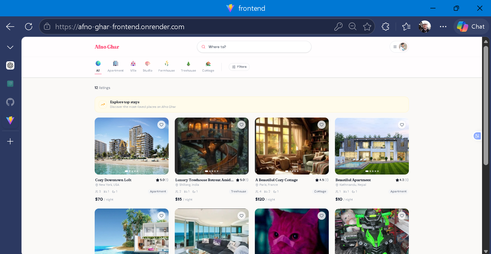
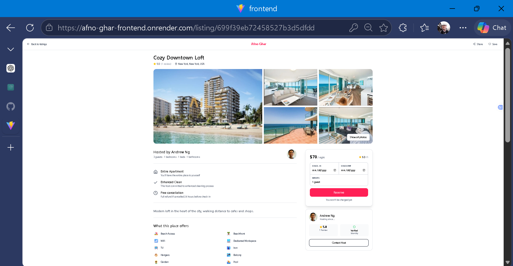
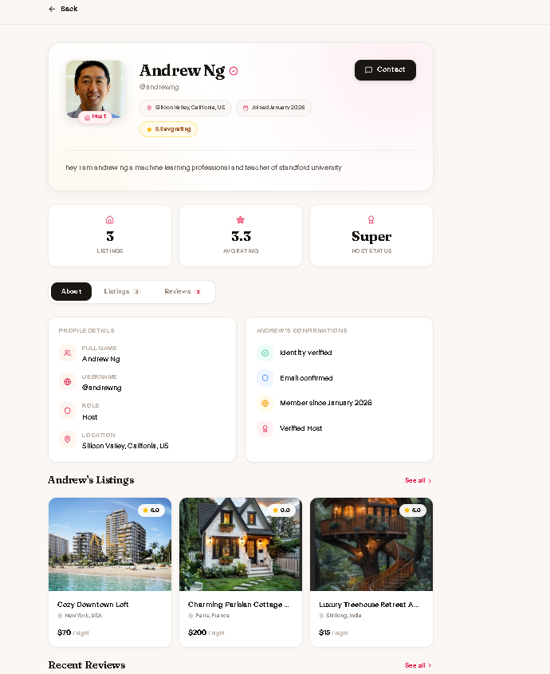
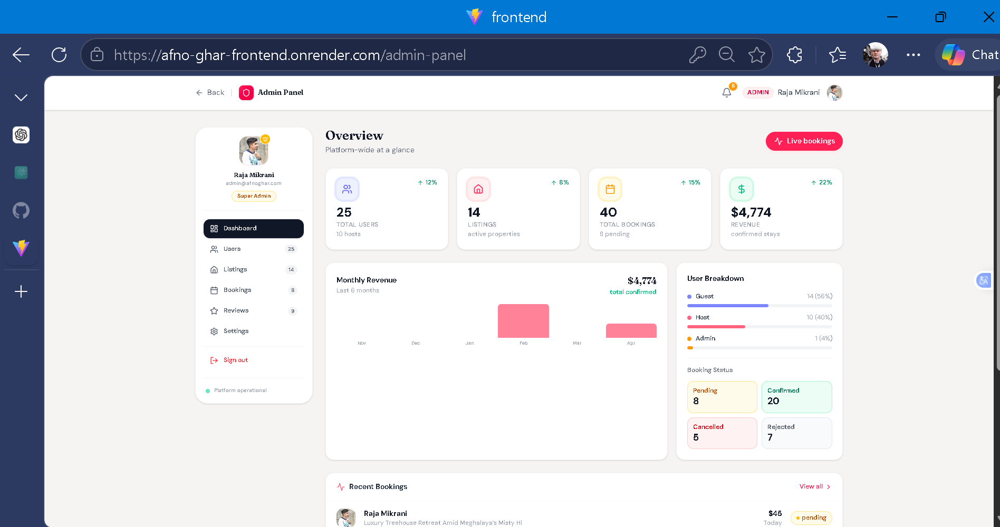
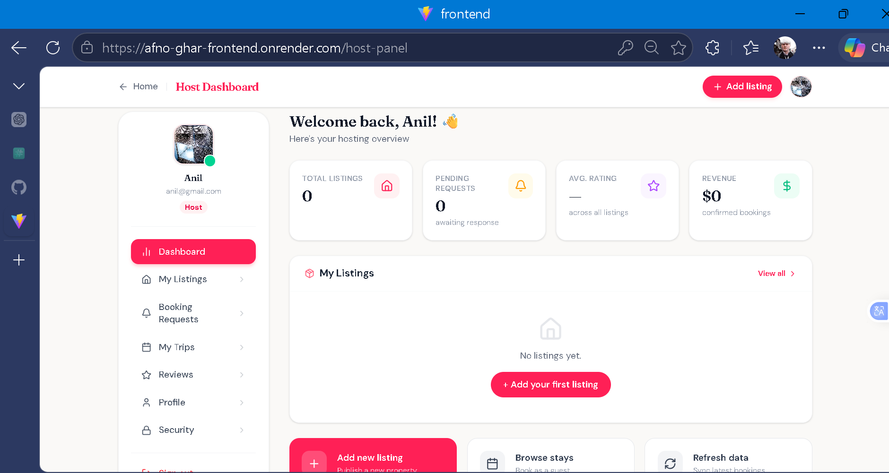

# 🏠 Afno Ghar

> **Afno Ghar** (अफ्नो घर) — *"Your Home"* in Nepali — is a full-stack home rental platform inspired by Airbnb, built with the MERN stack. It features personalised recommendations using Cosine Similarity, interactive maps, image uploads via Cloudinary, and role-based dashboards for Guests, Hosts, and Admins.

<p align="center">
  
  
  
  
  
  
  
</p>

---

## 📸 Preview

>





## ✨ Features

### 🧳 For Guests
- 🔍 Search listings by location, city, or country
- 📅 Filter by check-in / check-out dates and guest count
- 💰 Filter by price range (Under $50 / $50–$149 / $150+)
- 🏷️ Browse by dynamic categories (fetched from DB)
- 🤖 Personalised recommendations powered by **Cosine Similarity**
- ❤️ Wishlist — save and revisit favourite listings
- ⭐ View ratings and reviews on each listing
- 🗺️ Interactive maps via **Leaflet / React-Leaflet**

### 🏡 For Hosts
- 📋 Create, edit, and delete property listings
- 🖼️ Upload multiple listing images via **Cloudinary**
- 📊 Host dashboard to manage bookings and listings

### 🛠️ For Admins
- 👥 Manage all users, hosts, and guests
- 🗂️ Manage categories and amenities
- 📦 Full platform oversight via Admin Panel

---

## 🧠 Recommendation Engine

Afno Ghar uses a **content-based filtering** algorithm:

1. Fetches the user's **last 5 bookings** from the database
2. Encodes each booked listing into a **feature vector** (category, amenities, location coordinates, price)
3. **Averages** the vectors to build a single user preference profile
4. Computes **cosine similarity** between the profile and all other listings
5. Returns the **top-N most similar** listings as personalised picks

```
similarity = (A · B) / (||A|| × ||B||)
```

> If a user has no booking history, the system falls back to **trending listings** sorted by average rating.

---

## 🛠️ Tech Stack

### Backend — `afno_ghar` (v1.0.0)

| Package | Version | Purpose |
|---|---|---|
| express | ^5.2.1 | REST API server |
| mongoose | ^9.0.0 | MongoDB ODM |
| bcrypt | ^6.0.0 | Password hashing |
| jsonwebtoken | ^9.0.3 | JWT authentication |
| cloudinary | ^2.8.0 | Image upload & storage |
| multer | ^2.0.2 | Multipart file handling |
| cookie-parser | ^1.4.7 | Cookie management |
| cors | ^2.8.6 | Cross-origin requests |
| dotenv | ^17.2.3 | Environment variables |
| mongoose-aggregate-paginate-v2 | ^1.1.4 | Paginated aggregation |
| nodemon | ^3.1.11 | Dev auto-restart |
| prettier | ^3.7.4 | Code formatting |

### Frontend — `frontend` (v0.0.0)

| Package | Version | Purpose |
|---|---|---|
| react | ^19.2.0 | UI framework |
| react-dom | ^19.2.0 | DOM rendering |
| react-router-dom | ^7.12.0 | Client-side routing |
| axios | ^1.13.2 | HTTP requests |
| tailwindcss | ^4.1.18 | Utility-first CSS |
| @tailwindcss/vite | ^4.1.18 | Tailwind Vite plugin |
| leaflet | ^1.9.4 | Interactive maps |
| react-leaflet | ^5.0.0 | React map components |
| lucide-react | ^0.562.0 | Icon library |
| uuidv4 | ^6.2.13 | Unique ID generation |
| vite | ^7.2.4 | Build tool & dev server |

---

## 📁 Project Structure

```
Afno_ghar/
│
├── backend/                             # Node.js + Express server
│   ├── src/
│   │   ├── controllers/
│   │   │   ├── user.controller.js
│   │   │   ├── listing.controller.js
│   │   │   ├── booking.controller.js
│   │   │   ├── review.controller.js
│   │   │   ├── category.controller.js
│   │   │   ├── amenity.controller.js
│   │   │   ├── wishlist.controller.js
│   │   │   └── recommendation.controller.js
│   │   ├── models/
│   │   │   ├── User.model.js
│   │   │   ├── Listing.model.js
│   │   │   ├── Booking.model.js
│   │   │   ├── Review.model.js
│   │   │   ├── Category.model.js
│   │   │   └── Amenity.model.js
│   │   ├── routes/
│   │   ├── middlewares/
│   │   │   ├── auth.middleware.js
│   │   │   └── multer.middleware.js
│   │   ├── utils/
│   │   │   ├── cloudinary.js
│   │   │   ├── asyncHandler.js
│   │   │   └── ApiResponse.js
│   │   └── index.js
│   └── package.json
│
└── frontend/                            # React + Vite client
    ├── src/
    │   ├── pages/
    │   │   ├── Home.jsx                 # Landing page + recommendations
    │   │   ├── ListingDetail.jsx
    │   │   ├── HostPanel.jsx
    │   │   ├── GuestPanel.jsx
    │   │   ├── AdminPanel.jsx
    │   │   ├── Login.jsx
    │   │   └── Register.jsx
    │   ├── components/
    │   ├── service/
    │   │   └── api.js                   # Axios instance + all API calls
    │   └── App.jsx
    └── package.json
```

---

## 🚀 Getting Started

### Prerequisites

- **Node.js** v18+
- **MongoDB Atlas** account
- **Cloudinary** account (for image uploads)
- npm

---

### 1. Clone the Repository

```bash
git clone https://github.com/Rajamikrani/Afno_ghar.git
cd Afno_ghar
```

---

### 2. Setup the Backend

```bash
cd backend
npm install
```

Create a `.env` file inside `backend/`:

```env
PORT=8000

# MongoDB — copy the exact connection string from MongoDB Atlas > Connect > Drivers
MONGODB_URI=mongodb+srv://<username>:<password>@<cluster>.mongodb.net/afnoghar

# JWT
JWT_SECRET=your_super_secret_key
JWT_EXPIRES_IN=7d
JWT_COOKIE_EXPIRY=7

# Cloudinary
CLOUDINARY_CLOUD_NAME=your_cloud_name
CLOUDINARY_API_KEY=your_api_key
CLOUDINARY_API_SECRET=your_api_secret

# CORS
CORS_ORIGIN=http://localhost:5173
```

> ⚠️ **MongoDB tip:** If you get `EREFUSED` DNS errors, make sure:
> - Your IP is whitelisted in Atlas → **Network Access**
> - The connection string uses your actual cluster hostname (not the generic `cluster0`)

Run the backend:

```bash
npm run dev      # development with nodemon
npm start        # production
```

Server runs at **http://localhost:8000**

---

### 3. Setup the Frontend

```bash
cd frontend
npm install
```

Create a `.env` file inside `frontend/`:

```env
VITE_API_BASE_URL=http://localhost:8000/api/v1
```

Run the frontend:

```bash
npm run dev      # development
npm run build    # production build
npm run preview  # preview production build
```

App runs at **http://localhost:5173**

---

## 🔌 API Reference

### 🔐 Auth
| Method | Endpoint | Access | Description |
|--------|----------|--------|-------------|
| POST | `/api/v1/auth/register` | Public | Register new user |
| POST | `/api/v1/auth/login` | Public | Login, sets JWT cookie |
| POST | `/api/v1/auth/logout` | Private | Logout user |
| GET | `/api/v1/auth/me` | Private | Get current logged-in user |

### 🏠 Listings
| Method | Endpoint | Access | Description |
|--------|----------|--------|-------------|
| GET | `/api/v1/listings` | Public | Get all listings |
| GET | `/api/v1/listings/:id` | Public | Get single listing |
| POST | `/api/v1/listings` | Host | Create listing (with images) |
| PUT | `/api/v1/listings/:id` | Host | Update listing |
| DELETE | `/api/v1/listings/:id` | Host | Delete listing |

### 📅 Bookings
| Method | Endpoint | Access | Description |
|--------|----------|--------|-------------|
| POST | `/api/v1/bookings` | Guest | Create booking |
| GET | `/api/v1/bookings/my` | Guest | Get my bookings |
| PATCH | `/api/v1/bookings/:id/cancel` | Guest | Cancel booking |

### ❤️ Wishlist
| Method | Endpoint | Access | Description |
|--------|----------|--------|-------------|
| GET | `/api/v1/wishlist` | Private | Get my wishlist |
| POST | `/api/v1/wishlist/:id` | Private | Toggle wishlist item |

### 🤖 Recommendations
| Method | Endpoint | Access | Description |
|--------|----------|--------|-------------|
| GET | `/api/v1/recommendations` | Private | Get personalised recommendations |

### 🗂️ Categories & Amenities
| Method | Endpoint | Access | Description |
|--------|----------|--------|-------------|
| GET | `/api/v1/categories` | Public | Get all active categories |
| POST | `/api/v1/categories` | Admin | Create category |
| GET | `/api/v1/amenities` | Public | Get all active amenities |
| POST | `/api/v1/amenities` | Admin | Create amenity |

---

## 👥 User Roles

| Role | Capabilities |
|------|-------------|
| **Guest** | Search, view listings, book stays, wishlist, write reviews |
| **Host** | All Guest capabilities + create & manage own listings |
| **Admin** | Full platform management — users, listings, categories, amenities |

---

## 🗺️ Maps

Afno Ghar uses **Leaflet** with **React-Leaflet** to display listing locations on interactive maps. Listing coordinates are stored in MongoDB and rendered on the listing detail page.

---

## ☁️ Image Uploads

Images are handled via **Multer** (temporary local storage) → **Cloudinary** (permanent cloud storage). Each listing supports multiple images stored as an array of Cloudinary URLs in MongoDB.

---

## 🌍 Popular Destinations

Currently featuring stays across Nepal:

| Destination | Province |
|---|---|
| Kathmandu | Bagmati |
| Pokhara | Gandaki |
| Chitwan | Bagmati |
| Lumbini | Lumbini |
| Nagarkot | Bagmati |
| Bandipur | Gandaki |

---

## 🤝 Contributing

Contributions are welcome!

```bash
# 1. Fork the repo on GitHub

# 2. Create your feature branch
git checkout -b feature/your-feature-name

# 3. Commit your changes
git commit -m "feat: describe your change"

# 4. Push and open a Pull Request
git push origin feature/your-feature-name
```

Please follow existing code style — Prettier is configured on the backend (`npm run format`).

---

## 👨‍💻 Author

**Raja Mikrani**
- GitHub: [@Rajamikrani](https://github.com/Rajamikrani)

---

## 📄 License

This project is licensed under the **ISC License**.

---

<p align="center">Built with ❤️ in Nepal 🇳🇵 — <i>"Afno Ghar" means Your Home</i></p>